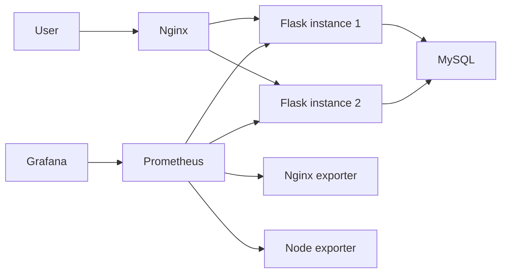

# SRE Demo

一个面向 SRE/运维实习投递的演示项目：用一个小型 Web 服务，把负载均衡、健康检查、可观测性、告警、Runbook 和资源取舍串成一条完整链路。

项目最初运行在一台 2C2G 的阿里云服务器上，因此主部署方式选择了 `Docker Compose`。这次整理保留了这条更符合真实资源约束的落地路径，同时补上 `Kubernetes` 清单、`SLO`、告警规则和演示文档，让它既能讲“怎么跑”，也能讲“怎么运维”。

## Project Snapshot

- 网关：Nginx 反向代理 + `least_conn` 负载均衡
- 应用：Flask + Gunicorn，暴露 `/health`、`/ready`、`/metrics`
- 存储：MySQL 5.7
- 监控：Prometheus + Grafana
- 编排：Docker Compose + Kubernetes Kustomize overlays
- 运维资产：告警规则、SLO、Runbook、自测脚本、CI 校验

## Architecture



## Why This Project Is Worth Showing

- 不只是把服务跑起来，而是把“服务如何被观测、告警、排障”一起补齐。
- 不硬上 Kubernetes，而是把 2C2G 单机的资源现实讲清楚，再给出可验证的迁移路径。
- 不只写代码，也补了 Dashboard provisioning、SLO、Runbook 和配置校验，让仓库更接近真实团队资产。

## Quick Start

### Docker Compose

```bash
cp .env.example .env
docker compose up -d --build
curl http://localhost:8080/health
curl http://localhost:8080/users
```

入口：

- Web: `http://localhost:8080`
- Prometheus: `http://localhost:9090`
- Grafana: `http://localhost:3000`

Windows 下可以直接运行：

```powershell
powershell -ExecutionPolicy Bypass -File .\scripts\smoke-test.ps1
```

### Kubernetes Demo

```bash
kind create cluster --name sre-demo
docker build -t sre-demo-web:local ./web
kind load docker-image sre-demo-web:local --name sre-demo
kubectl apply -k k8s/overlays/local
kubectl -n sre-demo get pods -w
curl http://localhost:30080/health
```

## Reliability Features

- `Nginx` 使用 `least_conn`，降低慢请求集中压在单实例上的概率。
- 应用区分 `/health` 和 `/ready`，避免数据库异常时继续接流量。
- `Prometheus` 抓取应用、主机和 Nginx 指标，`Grafana` 自动导入数据源和基础 Dashboard。
- 告警覆盖服务不可达、高 CPU、高 5xx 错误率和高延迟。
- `Kubernetes` 清单包含 `Deployment`、`StatefulSet`、`Service`、`PodDisruptionBudget` 和低资源 overlay。

## Project Structure

```text
.
|-- web/                    Flask application
|-- nginx/                  Nginx configuration
|-- prometheus/             Prometheus scrape config and alert rules
|-- monitoring/grafana/     Grafana provisioning and dashboard JSON
|-- k8s/                    Base manifests and overlays
|-- docs/                   Architecture, SLO, Kubernetes, resume notes
|-- runbooks/               Incident handling playbooks
|-- scripts/                Validation and smoke test scripts
|-- docker-compose.yml
`-- README.md
```

## Recommended Reading Order

- [架构说明](docs/architecture.md)
- [Kubernetes 部署说明](docs/kubernetes-deployment.md)
- [SLO](docs/slo.md)
- [简历/面试亮点](docs/resume-highlights.md)
- [高错误率 Runbook](runbooks/high-error-rate.md)
- [高延迟 Runbook](runbooks/high-latency.md)

## What I Would Say In An Interview

1. 这个项目最初部署在 2C2G 单机上，所以我优先选择了 Docker Compose，而不是为了“看起来高级”硬塞 Kubernetes。
2. 我把健康检查、就绪检查、监控、告警、Runbook 和资源限制一起做出来，让它从“能跑”变成“能运维”。
3. 后续如果要生产化，我会先把 MySQL 迁移到 RDS，再上多节点 Kubernetes，而不是继续让数据库和监控组件挤在同一台小机器上。
