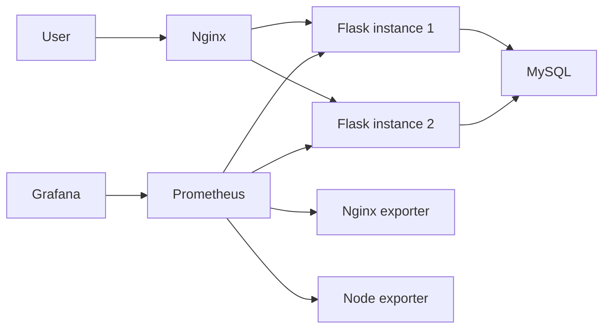

# SRE Demo

一个面向 SRE / 运维实习面试展示的完整项目。它用一套小型 Web 服务，把反向代理、健康检查、数据库依赖、指标采集、告警、Dashboard 和 Runbook 串成一条清晰的运维链路。

这个仓库的最终版本只保留稳定、可重复演示的 Docker Compose 路径，避免在本地面试演示时被额外的编排环境问题拖住节奏。

## 项目亮点

- Nginx 反向代理 + `least_conn` 负载均衡
- 两个 Flask 应用实例
- MySQL 持久化数据
- Prometheus 指标采集与告警
- Grafana 预置数据源和 Dashboard
- `/health`、`/ready`、`/metrics` 三类可观测性入口
- SLO、Runbook、验证脚本、冒烟脚本齐全

## 技术栈

- Flask
- Gunicorn
- MySQL 5.7
- Nginx
- Docker Compose
- Prometheus
- Grafana

## 一键启动

推荐直接使用脚本启动：

```powershell
powershell -ExecutionPolicy Bypass -File .\scripts\start-full-demo.ps1
```

脚本会优先读取仓库根目录下的 `.env`；如果没有，则回退到 `.env.example`。

启动成功后访问：

- Web: `http://localhost:8080`
- Prometheus: `http://localhost:9090`
- Grafana: `http://localhost:3000`

Grafana 默认账号信息来自环境文件：

- 用户名：`admin`
- 密码：查看 `.env` 或 `.env.example` 中的 `GRAFANA_PASSWORD`

停止环境：

```powershell
powershell -ExecutionPolicy Bypass -File .\scripts\stop-full-demo.ps1
```

## 服务架构



## 为什么这个项目适合面试

- 它不只是“服务能跑起来”，而是完整展示了“服务如何被观测、诊断和维护”。
- 面试时可以直接从请求入口一路讲到应用、数据库、监控和告警。
- 本地启动路径足够稳定，适合现场演示，不容易被环境波动打断。
- 文档、告警和 Runbook 让项目更像一个可以被运维的系统，而不只是一个 demo。

## 核心运维设计

- `Nginx` 使用 `least_conn`，降低慢请求集中压到单实例上的概率。
- 应用同时暴露 `/health` 和 `/ready`，区分“进程活着”和“服务真正可接流量”。
- `Prometheus` 采集应用、代理和节点指标。
- `Grafana` 自动加载预置数据源和 Dashboard。
- 告警规则覆盖服务不可达、高延迟、高 5xx 错误率等常见场景。
- `Runbook` 提供了高错误率和高延迟的排障路径。

## 项目结构

```text
.
|-- web/                    Flask application
|-- nginx/                  Nginx configuration
|-- prometheus/             Prometheus config and alert rules
|-- monitoring/grafana/     Grafana provisioning and dashboards
|-- docs/                   Architecture, SLO, resume notes
|-- runbooks/               Incident runbooks
|-- scripts/                Start, stop, validate, smoke test scripts
|-- docker-compose.yml
|-- init.sql
`-- README.md
```

## 常用命令

验证配置：

```powershell
powershell -ExecutionPolicy Bypass -File .\scripts\validate.ps1
```

冒烟测试：

```powershell
powershell -ExecutionPolicy Bypass -File .\scripts\smoke-test.ps1
```

手动启动：

```powershell
docker compose --env-file .env.example up -d --build
```

## 推荐阅读顺序

- [docs/architecture.md](/C:/Users/luci/Documents/Codex/2026-05-14/sre-sre-https-github-com-178124151/docs/architecture.md)
- [docs/slo.md](/C:/Users/luci/Documents/Codex/2026-05-14/sre-sre-https-github-com-178124151/docs/slo.md)
- [docs/resume-highlights.md](/C:/Users/luci/Documents/Codex/2026-05-14/sre-sre-https-github-com-178124151/docs/resume-highlights.md)
- [runbooks/high-error-rate.md](/C:/Users/luci/Documents/Codex/2026-05-14/sre-sre-https-github-com-178124151/runbooks/high-error-rate.md)
- [runbooks/high-latency.md](/C:/Users/luci/Documents/Codex/2026-05-14/sre-sre-https-github-com-178124151/runbooks/high-latency.md)
