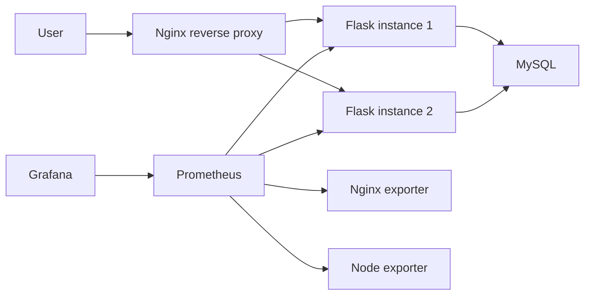

# Architecture

## Runtime Mode

This project is designed around a single Docker Compose deployment path for stable local demos and interview walkthroughs.

## Reliability Features

- Nginx uses `least_conn` to reduce request pileups on slow instances.
- Flask exposes `/health`, `/ready`, and `/metrics`.
- MySQL data is persisted with a Docker volume.
- Prometheus collects app, host, and Nginx metrics.
- Alerts cover service down, high CPU, high 5xx rate, and p99 latency.
