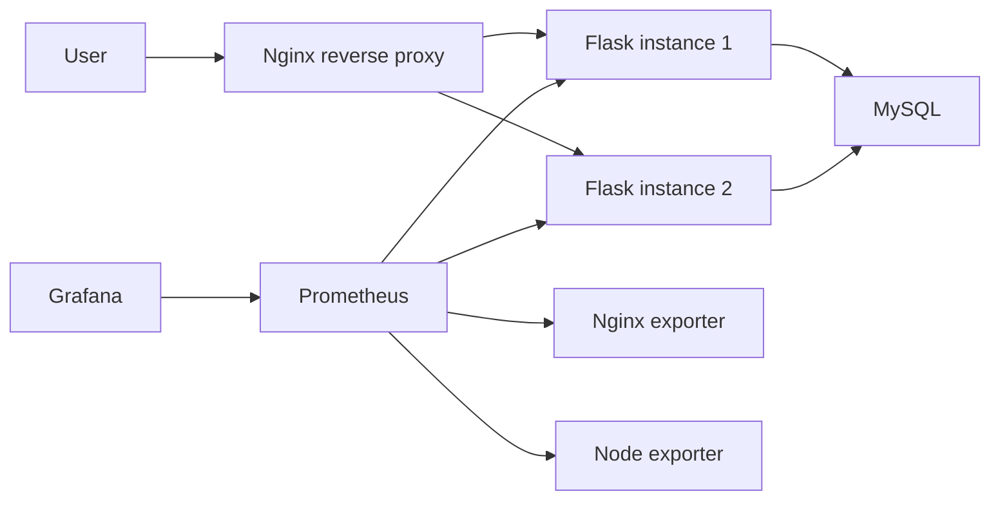

# Architecture

## Runtime Modes

| Mode | Purpose | Command |
| --- | --- | --- |
| Docker Compose | Small server deployment | `docker compose up -d` |
| Kubernetes local | Resume and interview demo | `kubectl apply -k k8s/overlays/local` |
| Kubernetes low resource | Documented 2C2G tradeoff | `kubectl apply -k k8s/overlays/aliyun-small` |

## Reliability Features

- Nginx uses `least_conn` to reduce request pileups on slow instances.
- Flask exposes `/health`, `/ready`, and `/metrics`.
- MySQL data is persisted with a volume in Compose and a PVC in Kubernetes.
- Prometheus collects app, host, and Nginx metrics.
- Alerts cover service down, high CPU, high 5xx rate, and p99 latency.
